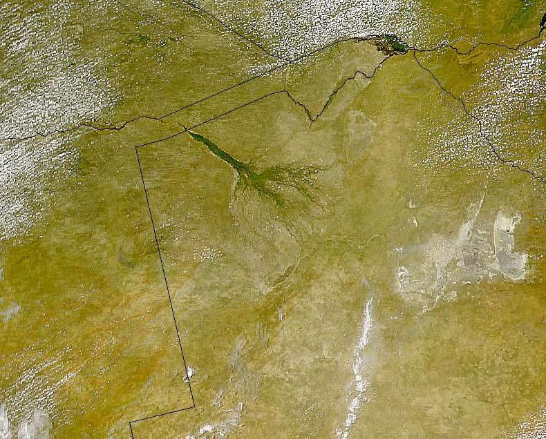
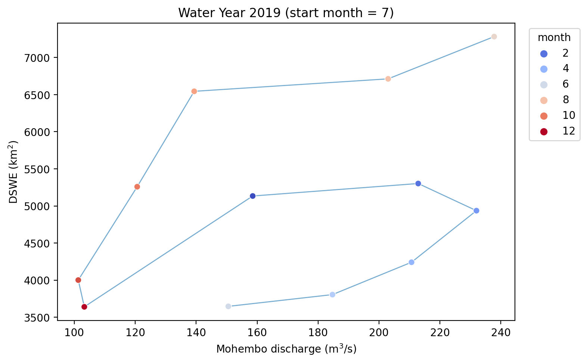
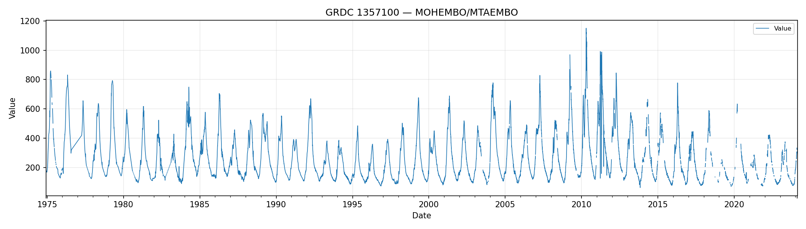

## DSWE - Inman Lyons comparison

Analysis of Okavango Delta flood dynamics using CYGNSS, DSWE (Landsat/Sentinel-2), GRACE, CHIRPS, and GRDC discharge data.

<p align="center">
  
  <br/>
  <em>SeaWiFS satellite image of the Okavango Delta, Botswana — a UNESCO World Heritage Site and one of the world's largest inland deltas. Image: NASA/Wikimedia Commons (public domain).</em>
</p>

---

## Project structure

```
src/
  gee_utils.py          — GCS/GEE upload helpers (gsutil wrappers, asset management)
  okavango_fronts.py    — Core analysis library: wet/dry front detection, front-normal
                          velocity, channel-parallel velocity, regional composites
  figures.py            — Shared figure saving utilities (registry-based)

notebooks/
  CYGNSS Okavango – Front-Normal Velocity.ipynb
                        — Merges daily CYGNSS NetCDF tiles; computes front-normal and
                          channel-parallel flood-pulse velocities; monthly composites
                          of expansion/contraction speed
  GRACE.ipynb           — GRACE/GRACE-FO terrestrial water storage anomaly analysis
  GRDC timeseries.ipynb — GRDC station discharge time series
  Mohembo time series.ipynb
                        — Mohembo gauge analysis and comparison with remote sensing
  dswe_IL_compare.ipynb — DSWE vs. Inman-Lyons inundation product comparison
  dswe_image_export.ipynb
                        — Export DSWE-derived rasters from GEE
  ET comparison over the delta.ipynb
                        — Evapotranspiration comparison over the Okavango Delta
  bucket_to_gee.ipynb   — Discover COGs in a GCS bucket and upload to GEE
  manage_gee_assets_okavango.ipynb
                        — Okavango-focused GEE asset maintenance
  download CYGNSS data.ipynb
                        — Download and stage raw CYGNSS NetCDF files
  download Chirps.ipynb — Download CHIRPS precipitation data
  archive/              — Date-prefixed archived notebooks

data/
  cygnss_okavango_daily/   — Per-day CYGNSS NetCDF tiles
  regions/                 — GeoPackages for basin/region masks (okavango_regions.gpkg)
  processed/               — Cached intermediate products (FNV monthly composites, etc.)
  chirps/                  — CHIRPS monthly precipitation grids
  grace_okavango_out/      — GRACE output for Okavango basin
  IL-OkavangoDelta_flooding-master/
                           — Inman-Lyons inundation reference dataset

data/GRDC_station_data/     — GRDC daily discharge files (.Cmd.txt) + basin GeoJSONs
```

---

## Requirements

Install Python dependencies:

```bash
pip install -e .
# or
pip install -r requirements.txt
```

Key dependencies: `xarray`, `numpy`, `pandas`, `geopandas`, `regionmask`, `shapely`,
`matplotlib`, `cartopy`, `earthengine-api`, `geemap`, `pyproj`, `netcdf4`.

Authenticate once for Earth Engine and GCloud:

```bash
earthengine authenticate
gcloud auth login
gcloud auth application-default login
```

---

## Key analysis: front-normal velocity (CYGNSS)

`src/okavango_fronts.py` provides the core flood-front analysis tools:

| Function | Description |
|---|---|
| `front_normal_velocity(da, t1, t2)` | Signed front-normal speed (m/day) between two dates |
| `front_speed_along_channels(ds_perp, gdf)` | Per-reach median speed along a channel network |
| `velocity_parallel_to_nearest_channel_field(ds_perp, gdf)` | Pixel-level component parallel to nearest channel |
| `classify_front_direction(ds_perp)` | Classify front motion relative to SE or an apex point |

Typical workflow in `CYGNSS Okavango – Front-Normal Velocity.ipynb`:

```python
from src.okavango_fronts import front_normal_velocity, front_speed_along_channels

da = xr.open_mfdataset("data/cygnss_okavango_daily/*.nc", ...)["variable"]
ds = front_normal_velocity(da, "2019-05-15", "2019-06-01", front_value=0.5)
ds["v_normal"].plot(cmap="RdBu_r", robust=True)
```

---

## Example results

### Flood-pulse phase space — water year 2019

<p align="center">
  
  <br/>
  <em>Flood extent (inundated area) vs. Mohembo discharge for water year 2019, showing the characteristic hysteresis loop of the Okavango flood pulse.</em>
</p>

### Mohembo discharge time series

<p align="center">
  
  <br/>
  <em>Daily discharge at the Mohembo gauging station (GRDC station 1357100) — the primary inflow to the Okavango Delta.</em>
</p>

---

## Development

- Analysis utilities live in `src/okavango_fronts.py` — extend there rather than duplicating in notebooks.
- GEE/GCS helpers live in `src/gee_utils.py`.
- Figure paths are tracked in `figures/registry.csv` via `src/figures.py`.
- Install the package in editable mode (`pip install -e .`) so `from src.X import Y` works from any notebook.

